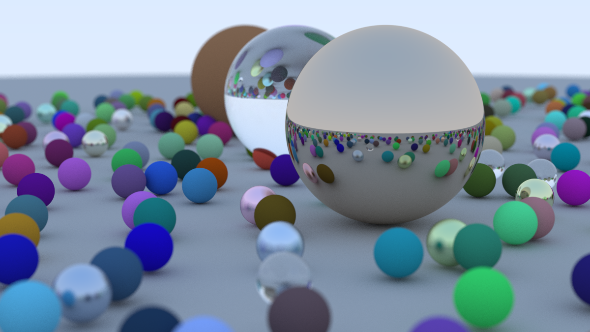
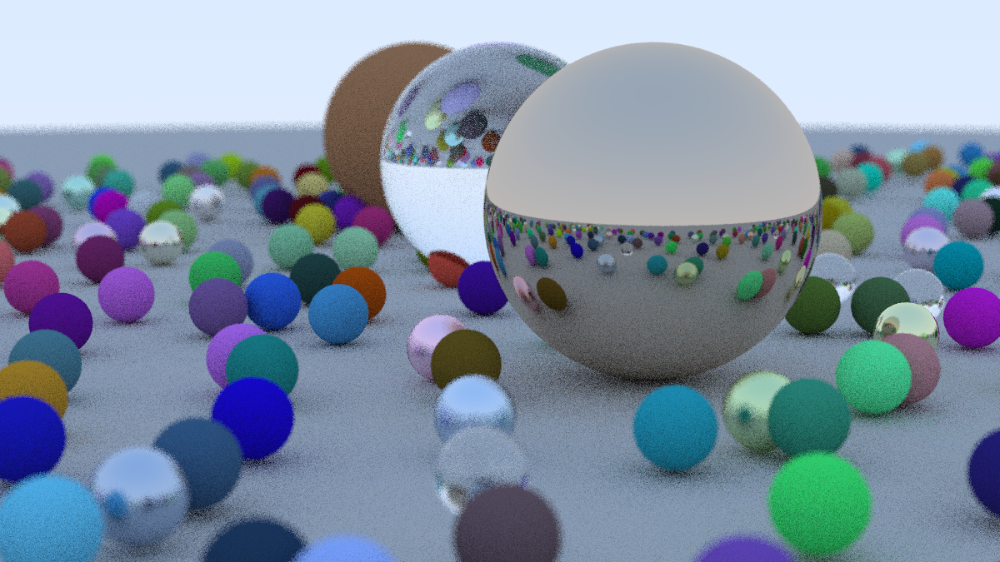
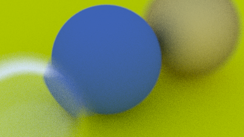
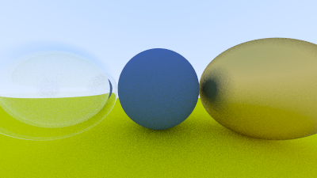
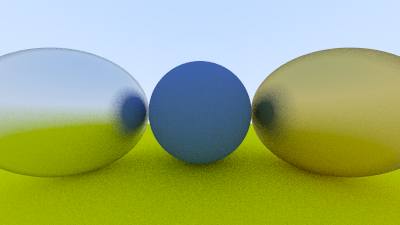
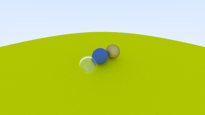
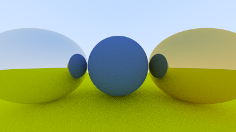

# raytracer

Basic ray tracer implementation in C++ following [_Ray Tracing In One Weekend_](https://raytracing.github.io/books/RayTracingInOneWeekend.html)

## Features

- Full implementation of the ray tracing tutorial
- **Parallel rendering with OpenMP** for significantly faster image generation
- Fallback to single-threaded mode if OpenMP is unavailable

## Rendered Outputs

### Final Scene (High Quality)


### Final Scene


### Depth of Field


### Hollow Glass Sphere


### Fuzzy Metal Materials


### Field of View


### Antialiasing


### Basic Render


## Building

```bash
mkdir build && cd build
cmake ..
make
./main
```

### OpenMP 

This project uses OpenMP for parallel rendering, which significantly speeds up image generation. The build will work without OpenMP, but rendering will be single-threaded and slower.

**macOS:**
```bash
brew install libomp
```

**Ubuntu/Debian:**
```bash
sudo apt install libomp-dev
```

**Fedora/RHEL:**
```bash
sudo dnf install libomp-devel
```

**Windows:**
OpenMP is typically included with Visual Studio. For MinGW, install via MSYS2.

If OpenMP is not found during the build, you'll see a warning but the project will still compile and run in single-threaded mode.
